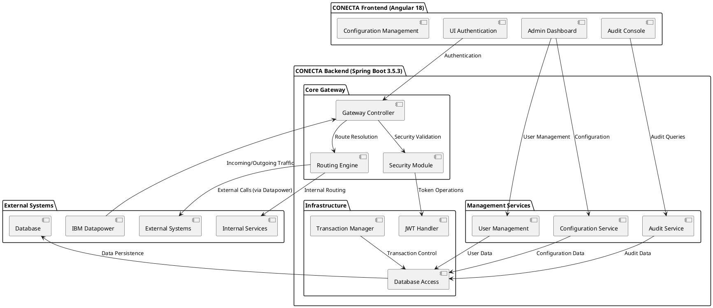
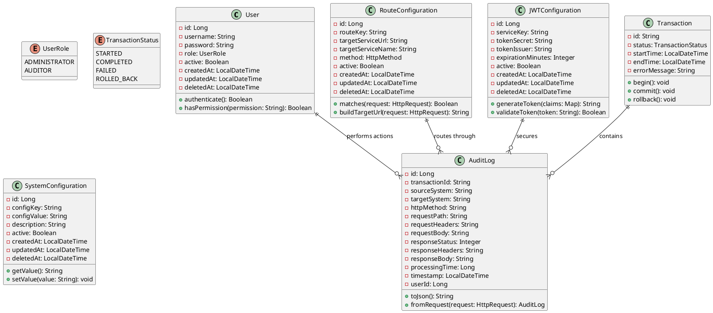
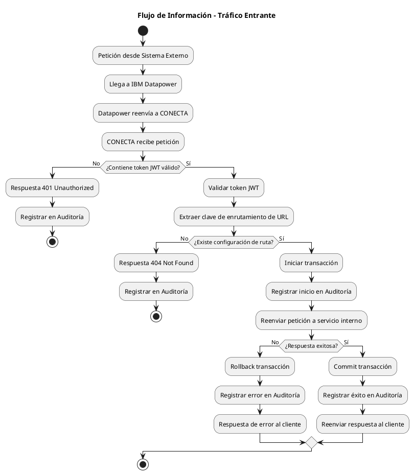
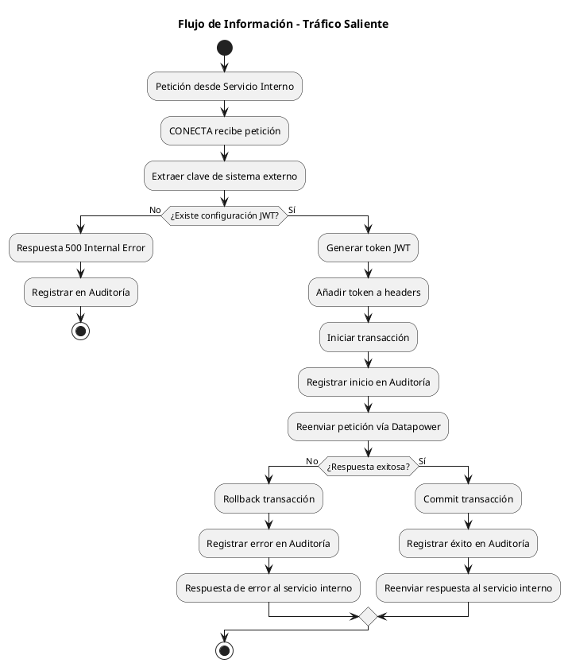
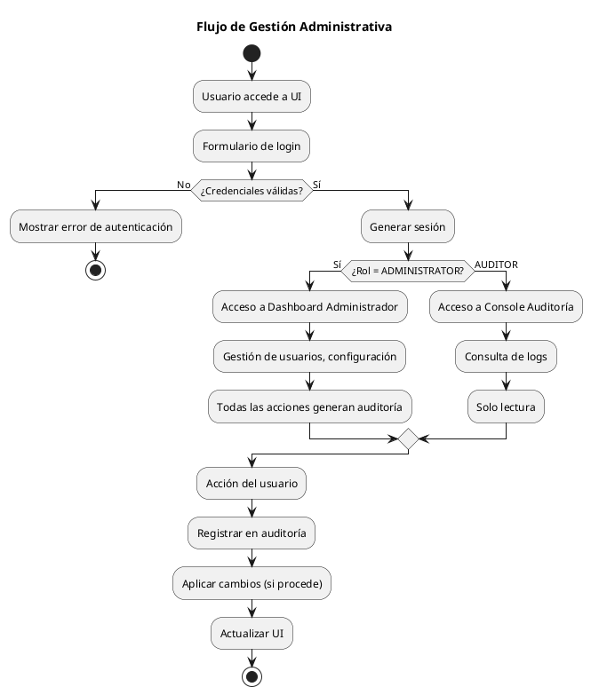

# Diagramas de Arquitectura CONECTA

## Diagrama de Módulos del Sistema

```plantuml
@startuml
package "CONECTA Frontend (Angular 18)" {
  [UI Authentication] as UIAuth
  [Admin Dashboard] as AdminDash
  [Audit Console] as AuditConsole
  [Configuration Management] as ConfigMgmt
}

package "CONECTA Backend (Spring Boot 3.5.3)" {
  package "Core Gateway" {
    [Gateway Controller] as GatewayCtrl
    [Routing Engine] as RoutingEngine
    [Security Module] as SecurityMod
  }
  
  package "Management Services" {
    [User Management] as UserMgmt
    [Configuration Service] as ConfigService
    [Audit Service] as AuditService
  }
  
  package "Infrastructure" {
    [JWT Handler] as JWTHandler
    [Transaction Manager] as TxManager
    [Database Access] as DBAccess
  }
}

package "External Systems" {
  [IBM Datapower] as Datapower
  [Internal Services] as InternalSvcs
  [External Systems] as ExternalSys
  [Database] as DB
}

' Frontend connections
UIAuth --> GatewayCtrl : Authentication
AdminDash --> UserMgmt : User Management
AdminDash --> ConfigService : Configuration
AuditConsole --> AuditService : Audit Queries

' Core Gateway connections
Datapower --> GatewayCtrl : Incoming/Outgoing Traffic
GatewayCtrl --> RoutingEngine : Route Resolution
GatewayCtrl --> SecurityMod : Security Validation
RoutingEngine --> InternalSvcs : Internal Routing
SecurityMod --> JWTHandler : Token Operations

' Management Services
UserMgmt --> DBAccess : User Data
ConfigService --> DBAccess : Configuration Data
AuditService --> DBAccess : Audit Data

' Infrastructure
TxManager --> DBAccess : Transaction Control
DBAccess --> DB : Data Persistence

' External routing
RoutingEngine --> ExternalSys : External Calls (via Datapower)

@enduml
```

## Diagrama de Clases de Dominio

```plantuml
@startuml
class User {
  - id: Long
  - username: String
  - password: String
  - role: UserRole
  - active: Boolean
  - createdAt: LocalDateTime
  - updatedAt: LocalDateTime
  - deletedAt: LocalDateTime
  + authenticate(): Boolean
  + hasPermission(permission: String): Boolean
}

enum UserRole {
  ADMINISTRATOR
  AUDITOR
}

class RouteConfiguration {
  - id: Long
  - routeKey: String
  - targetServiceUrl: String
  - targetServiceName: String
  - method: HttpMethod
  - active: Boolean
  - createdAt: LocalDateTime
  - updatedAt: LocalDateTime
  - deletedAt: LocalDateTime
  + matches(request: HttpRequest): Boolean
  + buildTargetUrl(request: HttpRequest): String
}

class JWTConfiguration {
  - id: Long
  - serviceKey: String
  - tokenSecret: String
  - tokenIssuer: String
  - expirationMinutes: Integer
  - active: Boolean
  - createdAt: LocalDateTime
  - updatedAt: LocalDateTime
  - deletedAt: LocalDateTime
  + generateToken(claims: Map): String
  + validateToken(token: String): Boolean
}

class AuditLog {
  - id: Long
  - transactionId: String
  - sourceSystem: String
  - targetSystem: String
  - httpMethod: String
  - requestPath: String
  - requestHeaders: String
  - requestBody: String
  - responseStatus: Integer
  - responseHeaders: String
  - responseBody: String
  - processingTime: Long
  - timestamp: LocalDateTime
  - userId: Long
  + toJson(): String
  + fromRequest(request: HttpRequest): AuditLog
}

class Transaction {
  - id: String
  - status: TransactionStatus
  - startTime: LocalDateTime
  - endTime: LocalDateTime
  - errorMessage: String
  + begin(): void
  + commit(): void
  + rollback(): void
}

enum TransactionStatus {
  STARTED
  COMPLETED
  FAILED
  ROLLED_BACK
}

class SystemConfiguration {
  - id: Long
  - configKey: String
  - configValue: String
  - description: String
  - active: Boolean
  - createdAt: LocalDateTime
  - updatedAt: LocalDateTime
  - deletedAt: LocalDateTime
  + getValue(): String
  + setValue(value: String): void
}

' Relationships
User ||--o{ AuditLog : "performs actions"
RouteConfiguration ||--o{ AuditLog : "routes through"
JWTConfiguration ||--o{ AuditLog : "secures"
Transaction ||--o{ AuditLog : "contains"

@enduml
```

## Diagrama de Flujo de Información

```plantuml
@startuml
title Flujo de Información - Tráfico Entrante

start
:Petición desde Sistema Externo;
:Llega a IBM Datapower;
:Datapower reenvía a CONECTA;
:CONECTA recibe petición;

if (¿Contiene token JWT válido?) then (No)
  :Respuesta 401 Unauthorized;
  :Registrar en Auditoría;
  stop
else (Sí)
  :Validar token JWT;
  :Extraer clave de enrutamiento de URL;
  
  if (¿Existe configuración de ruta?) then (No)
    :Respuesta 404 Not Found;
    :Registrar en Auditoría;
    stop
  else (Sí)
    :Iniciar transacción;
    :Registrar inicio en Auditoría;
    :Reenviar petición a servicio interno;
    
    if (¿Respuesta exitosa?) then (No)
      :Rollback transacción;
      :Registrar error en Auditoría;
      :Respuesta de error al cliente;
    else (Sí)
      :Commit transacción;
      :Registrar éxito en Auditoría;
      :Reenviar respuesta al cliente;
    endif
  endif
endif

stop
@enduml
```

```plantuml
@startuml
title Flujo de Información - Tráfico Saliente

start
:Petición desde Servicio Interno;
:CONECTA recibe petición;
:Extraer clave de sistema externo;

if (¿Existe configuración JWT?) then (No)
  :Respuesta 500 Internal Error;
  :Registrar en Auditoría;
  stop
else (Sí)
  :Generar token JWT;
  :Añadir token a headers;
  :Iniciar transacción;
  :Registrar inicio en Auditoría;
  :Reenviar petición vía Datapower;
  
  if (¿Respuesta exitosa?) then (No)
    :Rollback transacción;
    :Registrar error en Auditoría;
    :Respuesta de error al servicio interno;
  else (Sí)
    :Commit transacción;
    :Registrar éxito en Auditoría;
    :Reenviar respuesta al servicio interno;
  endif
endif

stop
@enduml
```

```plantuml
@startuml
title Flujo de Gestión Administrativa

start
:Usuario accede a UI;
:Formulario de login;

if (¿Credenciales válidas?) then (No)
  :Mostrar error de autenticación;
  stop
else (Sí)
  :Generar sesión;
  
  if (¿Rol = ADMINISTRATOR?) then (Sí)
    :Acceso a Dashboard Administrador;
    :Gestión de usuarios, configuración;
    :Todas las acciones generan auditoría;
  else (AUDITOR)
    :Acceso a Console Auditoría;
    :Consulta de logs;
    :Solo lectura;
  endif
endif

:Acción del usuario;
:Registrar en auditoría;
:Aplicar cambios (si procede);
:Actualizar UI;

stop
@enduml
```
