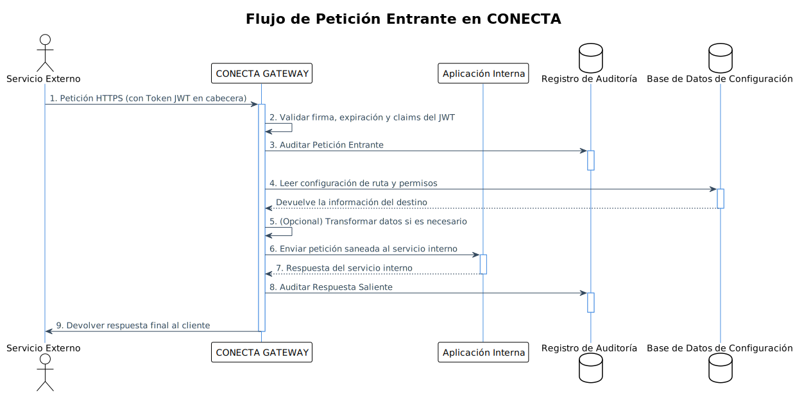

# Arquitectura del Sistema CONECTA API Gateway

## 1. Enfoque de Implementación

Para el desarrollo del sistema CONECTA API Gateway, analizaremos las áreas complejas de los requisitos y seleccionaremos las tecnologías adecuadas para su implementación.

### 1.1 Análisis de Puntos Difíciles

1. **Enrutamiento Dinámico**: Debe ser configurable sin reinicio y manejar reglas complejas.
2. **Seguridad JWT**: Manejo eficiente de validación y generación de tokens.
3. **Transaccionalidad**: Garantizar la integridad en un entorno distribuido.
4. **Alta Disponibilidad**: Asegurar operación continua y resistencia a fallos.
5. **Almacenamiento de Auditoría**: Gestionar grandes volúmenes de datos de auditoría de manera eficiente.
6. **Escalabilidad**: Soportar alto volumen de peticiones concurrentes.

### 1.2 Selección de Frameworks

#### Backend (Spring Boot)

1. **Spring Cloud Gateway**: Proporciona capacidades avanzadas de enrutamiento, predicados y filtros.
2. **Spring Security**: Para la autenticación y autorización mediante JWT.
3. **Spring Data JPA**: Para la persistencia de datos de configuración y auditoría.
4. **Spring Boot Actuator**: Para monitorización y métricas.
5. **Resilience4j**: Para implementar patrones como Circuit Breaker y Rate Limiting.
6. **Micrometer**: Para captura y exposición de métricas.
7. **Flyway**: Para gestión de versiones de la base de datos.

#### Frontend (Angular 18)

1. **NgRx**: Para gestión de estado en aplicaciones Angular.
2. **Angular Material**: Componentes UI prediseñados.
3. **ng2-charts**: Para visualización de datos y métricas.
4. **NgxDatatables**: Para visualización tabulada de datos de auditoría.
5. **RxJS**: Programación reactiva para manejo de flujos asincrónicos.

#### Herramientas Adicionales

1. **ElasticSearch**: Para almacenamiento y búsqueda eficiente de logs de auditoría.
2. **Redis**: Como caché distribuida para alto rendimiento.
3. **Kafka**: Para procesamiento de eventos de auditoría de manera asíncrona.
4. **Docker & Kubernetes**: Para contenerización y orquestación.
5. **Prometheus & Grafana**: Monitorización y alertas.

## 2. Arquitectura del Sistema

### 2.1 Visión General de Componentes

```
+---------------------+     +------------------+     +--------------------+
|                     |     |                  |     |                    |
| Sistemas Externos   |<--->|  IBM DataPower   |<--->|  CONECTA Gateway   |
|                     |     |                  |     |                    |
+---------------------+     +------------------+     +------+-------------+
                                                           |
                                                           v
+---------------------+     +------------------+     +--------------------+
|                     |     |                  |     |                    |
| Auditoría/Monitoreo |<--->| Configuración y  |<--->| Servicios Internos |
|                     |     | Administración   |     |                    |
+---------------------+     +------------------+     +--------------------+
```

### 2.2 Arquitectura de Componentes

La arquitectura de CONECTA se basa en un diseño modular con varios componentes independientes que trabajan en conjunto:

#### 2.2.1 Core Gateway (Spring Cloud Gateway)
- **Router Engine**: Maneja el enrutamiento de peticiones basado en reglas.
- **Security Filter**: Implementa validación y generación de JWT.
- **Transaction Manager**: Asegura la integridad de las operaciones.
- **Circuit Breaker**: Previene cascadas de fallos.

#### 2.2.2 Sistema de Configuración
- **Config Repository**: Almacena configuraciones de rutas, seguridad, etc.
- **Dynamic Config Manager**: Permite cambios en caliente sin reinicio.

#### 2.2.3 Sistema de Auditoría
- **Audit Logger**: Captura datos de auditoría.
- **Audit Repository**: Almacena logs para consulta.
- **Audit Search Engine**: Permite búsquedas avanzadas.

#### 2.2.4 Componente de Administración
- **Admin API**: APIs RESTful para gestión.
- **Admin UI**: Interfaz Angular para administradores.

#### 2.2.5 Sistema de Monitoreo
- **Metric Collector**: Recopila métricas de rendimiento.
- **Health Check**: Verifica estado del sistema.
- **Alert Manager**: Gestiona notificaciones.

## 3. Modelo de Datos y Interfaces

### 3.1 Diagrama de Clases

A continuación se presenta el modelo de datos principal y las interfaces del sistema:





```
classDiagram
    class ApiGateway {
        <<service>>
        -RouterEngine routerEngine
        -SecurityManager securityManager
        -AuditService auditService
        -TransactionManager transactionManager
        +initialize()
        +handleRequest(HttpRequest request) HttpResponse
        +shutdown()
    }
    
    class RouterEngine {
        -RouteRepository routeRepository
        -LoadBalancer loadBalancer
        -CircuitBreakerFactory circuitBreakerFactory
        +initRoutes()
        +routeRequest(HttpRequest request) ServiceEndpoint
        +updateRoute(Route route)
        +deleteRoute(String routeId)
        +getRoutes() List~Route~
    }
    
    class SecurityManager {
        -TokenValidator tokenValidator
        -TokenGenerator tokenGenerator
        -SecurityConfigRepository securityConfigRepository
        +validateToken(String token, String audience) boolean
        +generateToken(Map~String, Object~ claims) String
        +updateSecurityConfig(SecurityConfig config)
        +getSecurityConfigs() List~SecurityConfig~
    }
    
    class AuditService {
        -AuditRepository auditRepository
        -EventPublisher eventPublisher
        -CorrelationIdGenerator correlationIdGenerator
        +logTransaction(Transaction transaction)
        +findTransactions(AuditCriteria criteria) List~AuditRecord~
        +exportAudit(AuditCriteria criteria, String format) File
    }
    
    class TransactionManager {
        -IdempotencyStore idempotencyStore
        -TransactionRepository transactionRepository
        +beginTransaction(String correlationId) Transaction
        +commitTransaction(Transaction transaction)
        +rollbackTransaction(Transaction transaction)
        +isIdempotent(String requestId) boolean
    }
    
    class Route {
        -String id
        -String path
        -String targetService
        -Map~String, String~ headers
        -RoutingPolicy policy
        -TimeoutConfig timeout
        -RetryConfig retry
        -boolean enabled
        +getId() String
        +getPath() String
        +getTargetService() String
        +getHeaders() Map~String, String~
        +getPolicy() RoutingPolicy
        +getTimeout() TimeoutConfig
        +getRetry() RetryConfig
        +isEnabled() boolean
    }
    
    class SecurityConfig {
        -String id
        -String name
        -JwtConfig inboundJwt
        -JwtConfig outboundJwt
        -List~String~ allowedIps
        -List~String~ routeIds
        +getId() String
        +getName() String
        +getInboundJwt() JwtConfig
        +getOutboundJwt() JwtConfig
        +getAllowedIps() List~String~
        +getRouteIds() List~String~
    }
    
    class JwtConfig {
        -String issuer
        -String audience
        -String secret
        -String publicKey
        -String privateKey
        -long validitySeconds
        -List~String~ requiredClaims
        +validate(String token) boolean
        +generate(Map~String, Object~ claims) String
        +getIssuer() String
        +getAudience() String
    }
    
    class AuditRecord {
        -String id
        -String correlationId
        -Instant timestamp
        -String sourceIp
        -String targetService
        -String path
        -String method
        -Map~String, String~ headers
        -String requestBody
        -String responseBody
        -int statusCode
        -long responseTimeMs
        -String userId
        +getId() String
        +getCorrelationId() String
        +getTimestamp() Instant
        +getSourceIp() String
        +getTargetService() String
        +getPath() String
        +getMethod() String
    }
    
    class Transaction {
        -String id
        -String correlationId
        -TransactionStatus status
        -Instant startTime
        -Instant endTime
        -List~TransactionStep~ steps
        +addStep(TransactionStep step)
        +complete()
        +fail(Exception e)
        +getId() String
        +getStatus() TransactionStatus
    }
    
    class TransactionStep {
        -String id
        -String description
        -TransactionStepStatus status
        -Instant startTime
        -Instant endTime
        -Map~String, Object~ metadata
        +start()
        +complete()
        +fail(Exception e)
    }
    
    class AdminController {
        -RouteService routeService
        -SecurityService securityService
        -AuditService auditService
        -MetricsService metricsService
        +getRoutes() List~Route~
        +createRoute(Route route) Route
        +updateRoute(String id, Route route) Route
        +deleteRoute(String id)
        +getSecurityConfigs() List~SecurityConfig~
        +updateSecurityConfig(SecurityConfig config)
        +searchAuditLogs(AuditCriteria criteria) List~AuditRecord~
        +getMetrics(String metricType) List~Metric~
    }
    
    class MetricsService {
        -MetricRegistry metricRegistry
        -AlertService alertService
        +collectMetrics()
        +getMetrics(String metricType) List~Metric~
        +checkThresholds()
    }
    
    class ConfigurationService {
        -ConfigRepository configRepository
        -EventPublisher eventPublisher
        +loadConfiguration()
        +saveConfiguration(Configuration config)
        +refreshConfiguration()
    }
    
    ApiGateway --> RouterEngine
    ApiGateway --> SecurityManager
    ApiGateway --> AuditService
    ApiGateway --> TransactionManager
    RouterEngine --> Route
    SecurityManager --> SecurityConfig
    SecurityConfig --> JwtConfig
    AuditService --> AuditRecord
    TransactionManager --> Transaction
    Transaction --> TransactionStep
    AdminController --> MetricsService
    AdminController --> ConfigurationService
```

## 4. Flujo de Programa

### 4.1 Flujo de Solicitud Entrante

```
sequenceDiagram
    participant EXT as Sistema Externo
    participant DPW as IBM DataPower
    participant GATE as CONECTA Gateway
    participant ROUTE as RouterEngine
    participant SEC as SecurityManager
    participant AUDIT as AuditService
    participant TRANS as TransactionManager
    participant SVC as Servicio Interno
    
    EXT->>DPW: Envía solicitud con JWT
    DPW->>GATE: Reenvía solicitud
    
    GATE->>TRANS: beginTransaction(correlationId)
    TRANS-->>GATE: transaction
    
    GATE->>AUDIT: logTransactionStart(transaction)
    
    GATE->>SEC: validateToken(token, audience)
    SEC-->>GATE: tokenValido(boolean)
    
    alt token válido
        GATE->>ROUTE: routeRequest(request)
        ROUTE-->>GATE: endpoint
        
        GATE->>SVC: forwardRequest(request, endpoint)
        SVC-->>GATE: response
        
        GATE->>AUDIT: logTransaction(transaction, request, response)
        GATE->>TRANS: commitTransaction(transaction)
        GATE-->>DPW: response
        DPW-->>EXT: response
    else token inválido
        GATE->>AUDIT: logFailedAuth(transaction)
        GATE->>TRANS: rollbackTransaction(transaction)
        GATE-->>DPW: errorResponse(401)
        DPW-->>EXT: errorResponse(401)
    end
```

### 4.2 Flujo de Solicitud Saliente

```
sequenceDiagram
    participant SVC as Servicio Interno
    participant GATE as CONECTA Gateway
    participant ROUTE as RouterEngine
    participant SEC as SecurityManager
    participant AUDIT as AuditService
    participant TRANS as TransactionManager
    participant DPW as IBM DataPower
    participant EXT as Sistema Externo
    
    SVC->>GATE: Envía solicitud
    
    GATE->>TRANS: beginTransaction(correlationId)
    TRANS-->>GATE: transaction
    
    GATE->>AUDIT: logTransactionStart(transaction)
    
    GATE->>ROUTE: routeRequest(request)
    ROUTE-->>GATE: endpoint
    
    GATE->>SEC: generateToken(claims, audience)
    SEC-->>GATE: token
    
    GATE->>GATE: addTokenToRequest(request, token)
    
    GATE->>DPW: forwardRequest(request)
    DPW->>EXT: forwardRequest(request)
    
    EXT-->>DPW: response
    DPW-->>GATE: response
    
    GATE->>AUDIT: logTransaction(transaction, request, response)
    GATE->>TRANS: commitTransaction(transaction)
    
    GATE-->>SVC: response
```

### 4.3 Flujo de Actualización de Configuración

```
sequenceDiagram
    participant ADMIN as Usuario Administrador
    participant UI as Admin UI
    participant API as AdminController
    participant CONFIG as ConfigurationService
    participant REPO as ConfigRepository
    participant EVENT as EventPublisher
    participant COMP as Componentes Sistema
    
    ADMIN->>UI: Actualizar configuración
    UI->>API: updateConfig(config)
    
    API->>CONFIG: saveConfiguration(config)
    CONFIG->>REPO: save(config)
    REPO-->>CONFIG: success
    
    CONFIG->>EVENT: publishConfigChanged(config)
    EVENT->>COMP: notifyConfigChanged(config)
    
    COMP->>COMP: applyNewConfiguration()
    
    CONFIG-->>API: success
    API-->>UI: success
    UI-->>ADMIN: Confirmación
```

### 4.4 Flujo de Consulta de Auditoría

```
sequenceDiagram
    participant ADMIN as Usuario Administrador
    participant UI as Admin UI
    participant API as AdminController
    participant AUDIT as AuditService
    participant REPO as AuditRepository
    participant SEARCH as SearchEngine
    
    ADMIN->>UI: Buscar logs de auditoría
    UI->>API: searchAuditLogs(criteria)
    
    API->>AUDIT: findTransactions(criteria)
    AUDIT->>SEARCH: search(criteria)
    
    SEARCH->>REPO: executeQuery(queryParams)
    REPO-->>SEARCH: rawResults
    
    SEARCH-->>AUDIT: searchResults
    AUDIT-->>API: auditRecords
    
    API-->>UI: formattedAuditRecords
    UI-->>ADMIN: Display results
```

## 5. Componentes del Sistema en Detalle

### 5.1 Componentes para Enrutamiento Dinámico

#### RouterEngine
Implementado con Spring Cloud Gateway, este componente es responsable de:

- Analizar la URL entrante para extraer la clave de enrutamiento
- Mantener una tabla de enrutamiento en memoria actualizada desde la base de datos
- Aplicar reglas de enrutamiento configuradas dinámicamente
- Gestionar timeouts, reintentos y circuit breakers para cada ruta

```java
@Component
public class RouterEngine {
    private final RouteLocator routeLocator;
    private final RouteRepository routeRepository;
    private final CircuitBreakerFactory circuitBreakerFactory;
    
    // Métodos para inicializar, actualizar y gestionar rutas...
}
```

#### LoadBalancer
Proporciona distribución de carga entre múltiples instancias de un servicio:

- Estrategias configurables (round-robin, least-connections, etc.)
- Health checks para detectar instancias caídas
- Failover automático

### 5.2 Mecanismos de Autenticación y Seguridad

#### SecurityManager
Gestiona la autenticación y autorización mediante:

- Validación de tokens JWT entrantes (firma, expiración, claims)
- Generación de tokens JWT para tráfico saliente
- Aplicación de políticas de seguridad configuradas

#### TokenValidator
Validación avanzada de JWT con soporte para múltiples algoritmos de firma y proveedores.

#### TokenGenerator
Generación de tokens JWT con claims personalizados según el sistema externo destino.

### 5.3 Sistema de Auditoría y Trazabilidad

#### AuditService
Registra cada transacción que pasa por el gateway:

- Generación de IDs de correlación
- Captura de datos completos de solicitud y respuesta
- Almacenamiento eficiente en ElasticSearch para búsqueda rápida
- Exportación en diferentes formatos

#### CorrelationManager
Mantiene la trazabilidad entre solicitudes relacionadas:

- Genera y propaga IDs de correlación
- Permite seguimiento de transacciones end-to-end

### 5.4 Implementación de Transaccionalidad

#### TransactionManager
Asegura la integridad de las operaciones:

- Manejo de transacciones distribuidas
- Idempotencia para evitar operaciones duplicadas
- Mecanismos de compensación cuando sea necesario

#### IdempotencyStore
Previene el procesamiento múltiple de la misma solicitud:

- Almacena hashes de solicitudes procesadas
- Verifica solicitudes entrantes contra registro de idempotencia
- Limpieza automática basada en TTL configurable

### 5.5 Componentes para Configurabilidad y Escalabilidad

#### ConfigurationService
Gestiona la configuración dinámica del sistema:

- Carga inicial de configuración desde base de datos
- Actualización en caliente sin reinicio
- Distribución de cambios a todas las instancias

#### MetricsService
Monitorea el rendimiento del sistema:

- Recopilación de métricas (latencia, throughput, errores)
- Detección de anomalías
- Alertas automáticas basadas en umbrales

#### ClusterManager
Coordina operaciones entre múltiples instancias:

- Sincronización de configuración
- Distribución de carga
- Failover

### 5.6 Diseño de la UI Administrativa (Angular 18)

#### Estructura de Módulos

- **Core**: Servicios compartidos, autenticación, interceptores HTTP
- **Shared**: Componentes, directivas y pipes reutilizables
- **Features**:
  - Dashboard: Vista general del sistema
  - Routing: Gestión de rutas y endpoints
  - Security: Configuración de seguridad y JWT
  - Audit: Búsqueda y visualización de logs
  - Monitoring: Métricas y alertas
  - Settings: Configuración general del sistema

#### Componentes Principales

- **NavbarComponent**: Navegación principal
- **DashboardComponent**: Panel de control con KPIs
- **RouteListComponent**: Tabla de rutas configuradas
- **RouteEditorComponent**: Formulario para editar rutas
- **SecurityConfigComponent**: Gestión de configuraciones JWT
- **AuditSearchComponent**: Búsqueda avanzada de logs
- **AuditDetailComponent**: Visualización detallada de transacciones
- **MetricsComponent**: Gráficos de rendimiento
- **AlertsComponent**: Listado y configuración de alertas

## 6. Consideraciones de Despliegue

### 6.1 Arquitectura de Despliegue

```
+-------------------+    +-------------------+    +-------------------+
|  Load Balancer    |    |    Kubernetes     |    |   Database Tier   |
|  (HAProxy/NGINX)  |--->|    Cluster        |--->|   (PostgreSQL)    |
+-------------------+    +-------------------+    +-------------------+
                              |         |
                              v         v
                   +-------------------+    +-------------------+
                   |  Elasticsearch    |    |  Redis Cluster    |
                   |  Cluster          |    |                   |
                   +-------------------+    +-------------------+
```

### 6.2 Estrategia de Alta Disponibilidad

- Despliegue en múltiples zonas de disponibilidad
- Balanceo de carga entre instancias
- Health checks y auto-healing
- Bases de datos con replicación
- Cache distribuida con Redis

### 6.3 Escalabilidad

- Escalado horizontal de nodos Gateway
- Particionamiento de datos de auditoría
- Optimización de consultas
- Caché de rutas y configuraciones frecuentes
- Autoescalado basado en métricas

## 7. Aspectos No Claros y Consideraciones

### 7.1 Puntos a Clarificar

1. **Volumetría esperada**: Es crucial definir los TPS máximos esperados para dimensionar adecuadamente la infraestructura.

2. **Requisitos de retención de datos**: Definir por cuánto tiempo deben conservarse los logs de auditoría.

3. **Estrategia de gestión de secretos**: Determinar cómo se gestionarán las claves privadas para JWT.

4. **Integración específica con IBM DataPower**: Detalles técnicos sobre protocolos y configuraciones necesarias.

5. **Requisitos regulatorios**: Confirmar si existen requisitos específicos de cumplimiento normativo.

### 7.2 Consideraciones de Seguridad Adicionales

1. **Rotación de claves**: Implementar rotación periódica de claves de firma JWT

2. **Protección contra ataques DDoS**: Mecanismos de defensa en la capa de entrada

3. **Encriptación de datos sensibles**: Asegurar que la información sensible en los logs esté protegida

## 8. Conclusiones

La arquitectura propuesta para CONECTA API Gateway proporciona una solución robusta y escalable que cumple con los requisitos especificados. El uso de Spring Cloud Gateway como núcleo de enrutamiento, combinado con componentes personalizados para seguridad, auditoría y configuración, permite crear un sistema que centraliza y securiza todas las comunicaciones entre servicios internos y sistemas externos.

La implementación de patrones como Circuit Breaker, Rate Limiting e Idempotencia asegura la resiliencia del sistema ante fallos y picos de carga. La arquitectura modular facilita la extensibilidad y mantenimiento futuros, mientras que el diseño orientado a alta disponibilidad garantiza la continuidad del servicio.

La interfaz administrativa en Angular 18 proporciona a los administradores las herramientas necesarias para configurar, monitorear y auditar el sistema de manera eficiente, cumpliendo con el objetivo de simplificar la gestión de las APIs de la organización.