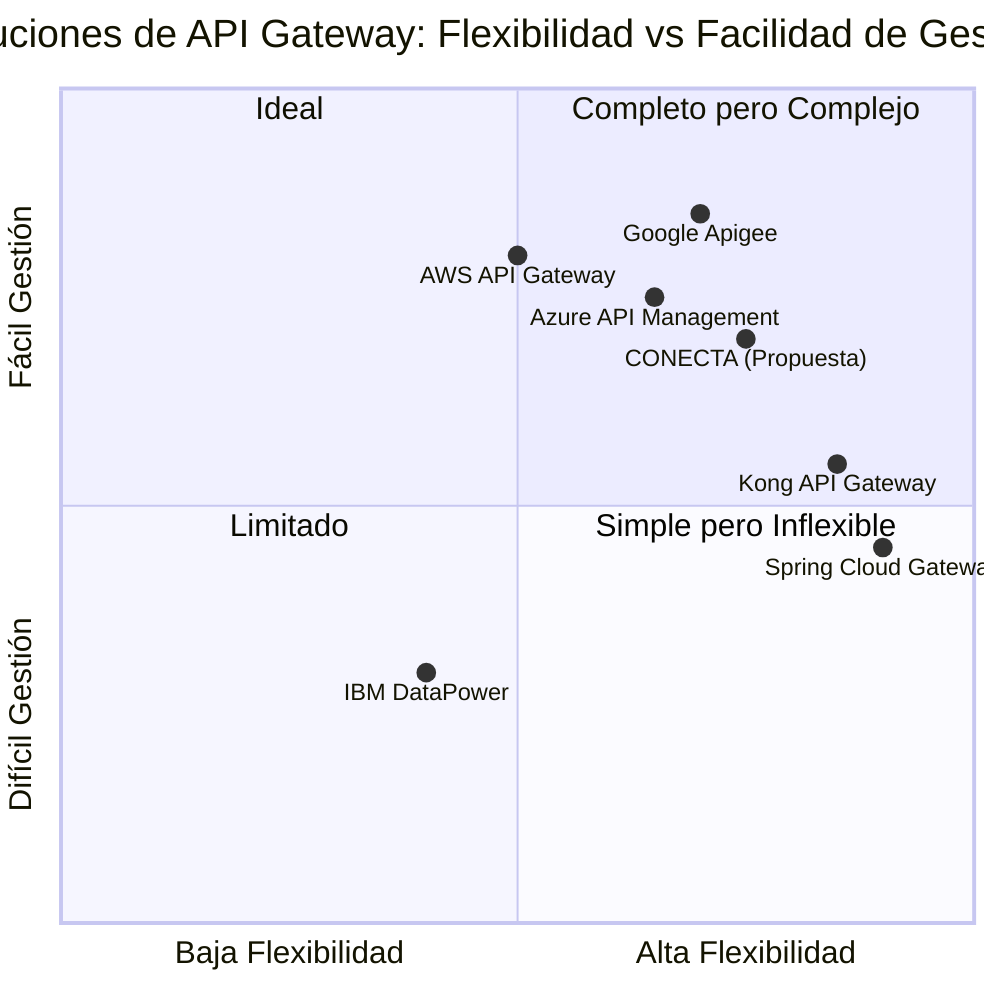

# Documento de Requisitos de Producto (PRD): CONECTA API Gateway

**Fecha**: 15 de junio de 2025  
**Versión**: 1.0  
**Elaborado por**: Emma  

## 1. Información del Proyecto

**Nombre del Proyecto**: conecta_api_gateway  
**Lenguajes de Programación**: Angular 18 (Frontend), Spring Boot (Backend)  
**Requerimientos Originales**:

Desarrollar una aplicación de software llamada CONECTA, que funcionará como un API Gateway centralizado para la organización. El objetivo principal es simplificar y securizar la comunicación entre servicios internos y sistemas externos. Actualmente, todo el tráfico de red, tanto entrante como saliente, debe pasar a través de un sistema IBM Datapower por motivos de seguridad. CONECTA se posicionará como el único punto de entrada y salida.

## 2. Definición del Producto

### 2.1 Objetivos del Producto

1. **Centralizar el Control**: Establecer un punto único para gestionar todas las comunicaciones entre sistemas internos y externos, reduciendo la complejidad de la configuración en IBM Datapower.

2. **Mejorar la Seguridad**: Implementar un sistema robusto de autenticación y autorización mediante tokens JWT para proteger tanto las comunicaciones entrantes como salientes.

3. **Optimizar la Observabilidad**: Proporcionar capacidades avanzadas de auditoría y trazabilidad para monitorizar y analizar todas las transacciones que fluyen a través del gateway.

### 2.2 Historias de Usuario

1. **Como** administrador de sistemas, **quiero** poder configurar dinámicamente los endpoints de enrutamiento **para** agregar nuevos servicios sin necesidad de redesplegar la aplicación.

2. **Como** arquitecto de seguridad, **quiero** que todas las solicitudes externas sean validadas mediante tokens JWT **para** garantizar que solo los usuarios autorizados accedan a los servicios internos.

3. **Como** desarrollador de servicios internos, **quiero** poder enviar solicitudes a sistemas externos a través de CONECTA **para** que se encargue automáticamente de añadir los tokens de autenticación necesarios.

4. **Como** auditor de sistemas, **quiero** poder consultar logs detallados de todas las transacciones **para** realizar análisis de seguridad y cumplimiento normativo.

5. **Como** operador de sistemas, **quiero** que la plataforma sea altamente disponible y escalable **para** manejar picos de tráfico sin degradación del servicio.

### 2.3 Análisis Competitivo

| Solución | Pros | Contras |
|----------|------|--------|
| **CONECTA (Solución Propuesta)** | - Diseñado específicamente para necesidades de la organización<br>- Integración directa con IBM Datapower<br>- Interfaz de administración a medida<br>- Funcionalidades específicas para auditoría interna | - Desarrollo desde cero<br>- Tiempo de desarrollo mayor que soluciones comerciales<br>- Requiere mantenimiento interno |
| **Kong API Gateway** | - Open source con opción empresarial<br>- Amplio ecosistema de plugins<br>- Alta flexibilidad y personalización<br>- Soporte para múltiples protocolos | - Curva de aprendizaje pronunciada<br>- Implementación compleja para casos avanzados<br>- Soporte empresarial costoso |
| **AWS API Gateway** | - Integración perfecta con servicios AWS<br>- Alta escalabilidad automática<br>- Modelo de pago por uso<br>- Bajo mantenimiento | - Dependencia del proveedor cloud<br>- Menos flexible para despliegues híbridos<br>- Costos pueden escalar con alto tráfico |
| **Azure API Management** | - Portal de desarrolladores robusto<br>- Buenas capacidades analíticas<br>- Autenticación avanzada<br>- Integración con ecosistema Azure | - Modelo de pricing complejo<br>- Rendimiento variable según región<br>- Orientado principalmente a nube |
| **Google Apigee** | - Potentes capacidades analíticas<br>- Excelente portal para desarrolladores<br>- Solución completa de gestión de API<br>- Aceleradores específicos por industria | - Precio elevado<br>- Complejo para casos de uso simples<br>- Sobredimensionado para necesidades básicas |
| **IBM DataPower Gateway** | - Ya implementado en la organización<br>- Sólidas capacidades de seguridad<br>- Optimizado para entornos empresariales<br>- Integraciones preconfiguradas | - Configuración compleja<br>- Interfaz de usuario anticuada<br>- Alto costo de licencias<br>- Baja agilidad para cambios |
| **Spring Cloud Gateway** | - Basado en Spring (misma tecnología de backend)<br>- Código abierto<br>- Gran comunidad y documentación<br>- Altamente extensible | - No incluye UI de administración<br>- Requiere desarrollo adicional<br>- Menos características empresariales |

### 2.4 Cuadrante Competitivo



## 3. Especificaciones Técnicas

### 3.1 Análisis de Requisitos

#### Arquitectura General

CONECTA actuará como intermediario entre los sistemas externos y los servicios internos de la organización, posicionándose como la única vía de comunicación aprobada. Este enfoque permite:

1. Simplificar la topología de red al eliminar múltiples conexiones punto a punto
2. Centralizar la política de seguridad en un único componente
3. Proporcionar una capa de abstracción que oculta los detalles de implementación internos
4. Facilitar la evolución independiente de servicios sin afectar a consumidores externos

El flujo de funcionamiento será:

- **Para tráfico entrante**: Sistemas externos → IBM Datapower → CONECTA → Servicios internos
- **Para tráfico saliente**: Servicios internos → CONECTA → IBM Datapower → Sistemas externos

#### Requisitos Funcionales Detallados

1. **Enrutamiento Dinámico**
   - El sistema debe analizar la URL entrante para extraer el segmento de ruta que define el servicio destino
   - DEBE mantener una tabla de enrutamiento configurable que mapee segmentos de URL a endpoints de servicios internos
   - DEBE soportar la actualización dinámica de esta tabla sin reinicio o redespliegue
   - DEBE permitir configuración de timeouts, reintentos y circuit breakers por ruta

2. **Autenticación y Seguridad**
   - DEBE validar tokens JWT en solicitudes entrantes verificando firma, expiración y reclamaciones
   - DEBE rechazar solicitudes con tokens inválidos o expirados
   - DEBE agregar tokens JWT apropiados en solicitudes salientes hacia sistemas externos
   - DEBE manejar múltiples configuraciones de JWT para diferentes sistemas externos
   - DEBE implementar un sistema de renovación de tokens cuando sea necesario
   - NO DEBE requerir autenticación para servicios internos que se comunican con CONECTA

3. **Auditoría y Trazabilidad**
   - DEBE registrar cada transacción incluyendo timestamp, origen, destino, parámetros y resultado
   - DEBE almacenar tanto la solicitud original como la respuesta recibida
   - DEBE generar IDs únicos de correlación para cada transacción para facilitar seguimiento
   - DEBE proporcionar búsqueda y filtrado avanzado de logs de auditoría
   - DEBERÍA implementar exportación de logs a formatos estándar (CSV, JSON)

4. **Transaccionalidad**
   - DEBE garantizar la integridad de los datos durante el enrutamiento y reenvío de mensajes
   - DEBE implementar mecanismos para evitar procesamientos duplicados (idempotencia)
   - DEBE manejar adecuadamente los fallos y rollbacks cuando sea apropiado
   - DEBE proporcionar confirmación de entrega de mensajes
   - DEBERÍA implementar mecanismos de compensación para transacciones distribuidas

5. **Configurabilidad y Escalabilidad**
   - DEBE ofrecer una interfaz para configurar enrutamiento, seguridad y comportamientos
   - DEBE soportar configuración por entorno (desarrollo, pruebas, producción)
   - DEBE ser escalable horizontalmente para manejar incrementos de carga
   - DEBE implementar balanceo de carga entre instancias
   - DEBE soportar alta disponibilidad con failover automático
   - DEBERÍA implementar caché de respuestas para optimizar rendimiento

6. **Interfaz de Usuario**
   - DEBE proporcionar un dashboard para visualización de métricas y estado del sistema
   - DEBE ofrecer herramientas para consultar y analizar logs de auditoría
   - DEBE permitir la configuración de rutas, endpoints y políticas de seguridad
   - DEBE implementar control de acceso basado en roles para la interfaz
   - DEBERÍA proporcionar alertas y notificaciones configurables

### 3.2 Pool de Requisitos

#### P0 (Críticos / Debe tener)
1. Enrutamiento dinámico basado en segmentos de URL
2. Validación de tokens JWT para tráfico entrante
3. Adición de tokens JWT para tráfico saliente
4. Registro de auditoría de todas las transacciones
5. Interfaz de administración para configuración básica
6. Alta disponibilidad y tolerancia a fallos
7. Configuración dinámica sin reinicios
8. Manejo transaccional básico para garantizar integridad

#### P1 (Importantes / Debería tener)
1. Métricas avanzadas de rendimiento y uso
2. Capacidades de caché para respuestas frecuentes
3. Circuit breakers para prevenir cascada de fallos
4. Búsqueda avanzada en logs de auditoría
5. Exportación de logs a formatos estándar
6. Sistema de notificaciones y alertas
7. Balanceo de carga inteligente
8. Versionado de API

#### P2 (Deseables / Podría tener)
1. Portal para desarrolladores externos
2. Transformación de formatos de mensaje (XML/JSON/etc.)
3. Mock services para pruebas
4. Rate limiting configurable
5. Análisis predictivo de tráfico
6. Integración con sistemas de monitoreo externos
7. Registro histórico de cambios de configuración
8. Gestión de cuotas por consumidor

### 3.3 Diseño de UI

La interfaz de usuario de CONECTA constará de los siguientes componentes principales:

#### Panel de Control (Dashboard)
- Vista general del estado del sistema
- Gráficos de tráfico en tiempo real
- Indicadores de rendimiento clave (KPIs)
- Alertas activas y recientes

#### Gestión de Enrutamiento
- Tabla de rutas configuradas
- Formulario para añadir/editar rutas
- Visualización de dependencias entre servicios
- Estado de cada ruta (activa, degradada, inactiva)

#### Auditoría y Logs
- Buscador avanzado con múltiples criterios
- Visualización detallada de transacciones
- Línea de tiempo de actividad
- Exportación de resultados

#### Configuración de Seguridad
- Gestión de certificados y claves
- Configuración de proveedores JWT
- Políticas de seguridad por ruta
- Registro de eventos de seguridad

#### Administración del Sistema
- Gestión de usuarios y roles
- Configuración de entornos
- Opciones de respaldo y recuperación
- Monitoreo de recursos (CPU, memoria, red)

### 3.4 Arquitectura Técnica

```
+----------------+     +---------------+     +----------------+
|                |     |               |     |                |
| Sistemas       |     |    IBM        |     |    CONECTA     |
| Externos       |<--->|  DataPower    |<--->|    Gateway     |
|                |     |               |     |                |
+----------------+     +---------------+     +-------+--------+
                                                    |
                                                    |
                                                    v
                                       +------------------------+
                                       |                        |
                                       |   Servicios Internos   |
                                       |                        |
                                       +------------------------+
```

#### Componentes Principales

1. **API Gateway Core**
   - Motor de enrutamiento
   - Gestor de autenticación
   - Sistema de auditoría
   - Manejador de transacciones

2. **Almacenamiento de Configuración**
   - Base de datos para configuraciones
   - Caché distribuida para alto rendimiento
   - Sistema de respaldo y versionado

3. **Sistema de Logs y Auditoría**
   - Almacenamiento optimizado para búsquedas
   - Rotación y archivado de logs
   - Exportadores para sistemas externos

4. **Interfaz de Administración**
   - Frontend en Angular 18
   - APIs para configuración y consulta
   - Sistema de autenticación para administradores

5. **Monitoreo y Alertas**
   - Recopilación de métricas
   - Motor de reglas para alertas
   - Notificaciones y escalado

## 4. Preguntas Abiertas

1. ¿Cuál es la volumetría esperada de transacciones por segundo en horas pico?

2. ¿Existen requisitos específicos de latencia máxima que debe introducir el gateway?

3. ¿Qué periodo de retención se requiere para los logs de auditoría?

4. ¿Hay requisitos regulatorios específicos que deban cumplirse (GDPR, PCI-DSS, etc.)?

5. ¿Cuál es la estrategia para la gestión de los secretos y llaves privadas utilizadas para la validación de JWT?

6. ¿Se requiere integración con algún sistema de Identity Provider específico?

7. ¿Cuál es el plan de migración desde la configuración actual en IBM DataPower?

8. ¿Existen requisitos de geolocalización o multi-región para el despliegue?

## 5. Cronograma Estimado

1. **Fase 1: Configuración Básica y Enrutamiento** (4 semanas)
   - Implementación del núcleo de enrutamiento
   - Configuración dinámica básica
   - Integración con IBM DataPower

2. **Fase 2: Seguridad y Autenticación** (3 semanas)
   - Sistema de validación JWT
   - Gestión de tokens para tráfico saliente
   - Políticas de seguridad básicas

3. **Fase 3: Auditoría y Transaccionalidad** (3 semanas)
   - Sistema de logs y trazabilidad
   - Mecanismos de idempotencia
   - Consistencia transaccional

4. **Fase 4: Interfaz de Administración** (5 semanas)
   - Desarrollo del frontend
   - APIs de configuración y consulta
   - Dashboard y visualizaciones

5. **Fase 5: Escalabilidad y Alta Disponibilidad** (4 semanas)
   - Clustering y balanceo
   - Mecanismos de failover
   - Optimización de rendimiento

6. **Fase 6: Pruebas y Despliegue** (3 semanas)
   - Pruebas de integración
   - Pruebas de carga y estrés
   - Despliegue en entornos de producción

## 6. Métricas de Éxito

1. **Rendimiento**
   - Latencia introducida por el gateway < 50ms en el p99
   - Capacidad para manejar >1000 TPS sin degradación

2. **Disponibilidad**
   - Uptime de 99.95% o superior
   - Tiempo de recuperación ante fallos < 30 segundos

3. **Seguridad**
   - 0 brechas de seguridad reportadas
   - 100% de peticiones externas autenticadas correctamente

4. **Usabilidad**
   - Tiempo promedio para configurar una nueva ruta < 5 minutos
   - Satisfacción de usuarios administradores > 4/5

5. **Negocio**
   - Reducción del 80% en tiempo de configuración comparado con IBM DataPower
   - Reducción del 30% en incidentes relacionados con conectividad de API

## 7. Conclusión

CONECTA representa una evolución significativa en la arquitectura de integración de la organización, proporcionando un punto centralizado para la gestión de APIs que combina seguridad robusta, facilidad de administración y visibilidad completa de las comunicaciones. El enfoque propuesto permitirá simplificar la topología de red actual mientras se mejora la seguridad y se facilita la incorporación de nuevos servicios.

La implementación gradual en fases permite priorizar las funcionalidades críticas mientras se construye una base sólida para características avanzadas. La solución final ofrecerá un balance óptimo entre flexibilidad y facilidad de gestión, posicionándose favorablemente frente a alternativas comerciales y de código abierto.